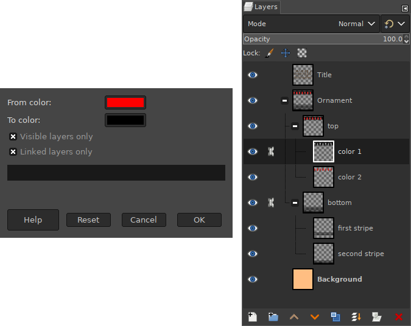

# MHL-Colour Exchange on All Layers
With this Script-Fu you can exchange one colour with another on several layers.
Select desired layers whith visibility or/and linking.
Or, if you want to swap colours on all layers, just turn off the switches in the plugin dialog.

## INSTALLATION
Place the script file in to the Gimp scripts directory. You can find it in the preferences.
> Edit -> Preferences -> Folders -> Scripts

