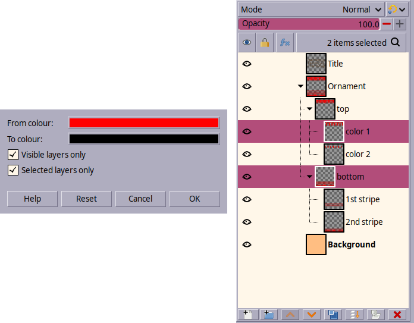
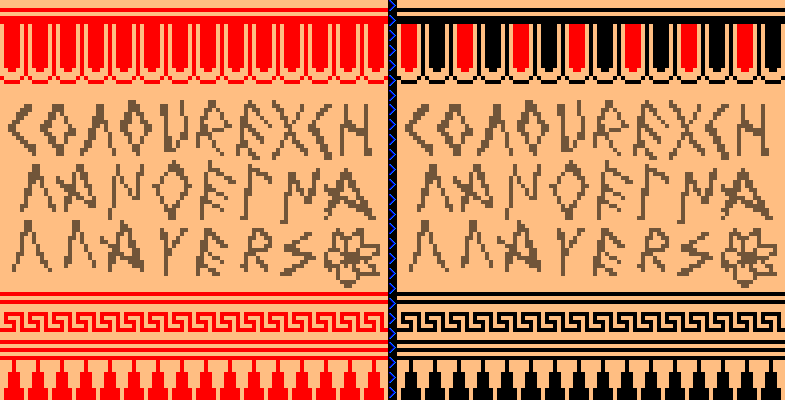

# MHL-Colour Exchange on All Layers
This Script-Fu for GIMP 3.x lets you exchange one colour for another across
multiple layers. Select the desired layers via visibility or/and selection. Or, if
you want to swap colours on all layers, just turn off the switches in the
plugin dialog.

## INSTALLATION
Put `mhl-colour-exchange-on-all-layers.scm` into the GIMP scripts directory
and restart GIMP.

> [!TIP]
> You can find the script directories in GIMP preferences:
>
> Edit -> Preferences -> Folders -> Scripts

## USAGE
Script must be avaliable in GIMP main menu:
> Filters -> MHL -> Colour Exchange on All Layers

## GIMP 2 (Legacy)

The previous version for GIMP 2.x is available in the
`gimp2-legacy/` directory.
