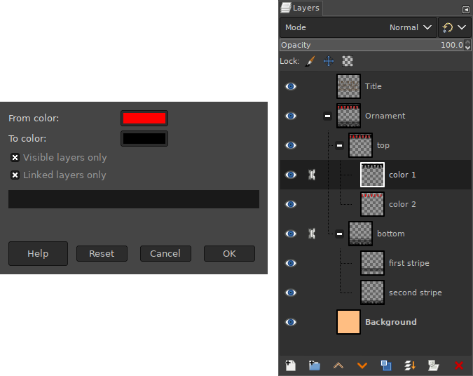

# MHL-Colour Exchange on All Layers
This Script-Fu for GIMP 2.x lets you exchange one colour for another across
multiple layers. Select the desired layers via visibility or/and linking. Or, if
you want to swap colours on all layers, just turn off the switches in the
plugin dialog.

## INSTALLATION
Place the script file into the Gimp scripts directory. You can find it in GIMP preferences.
> Edit -> Preferences -> Folders -> Scripts

